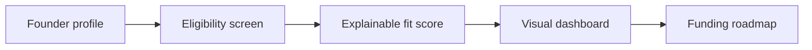
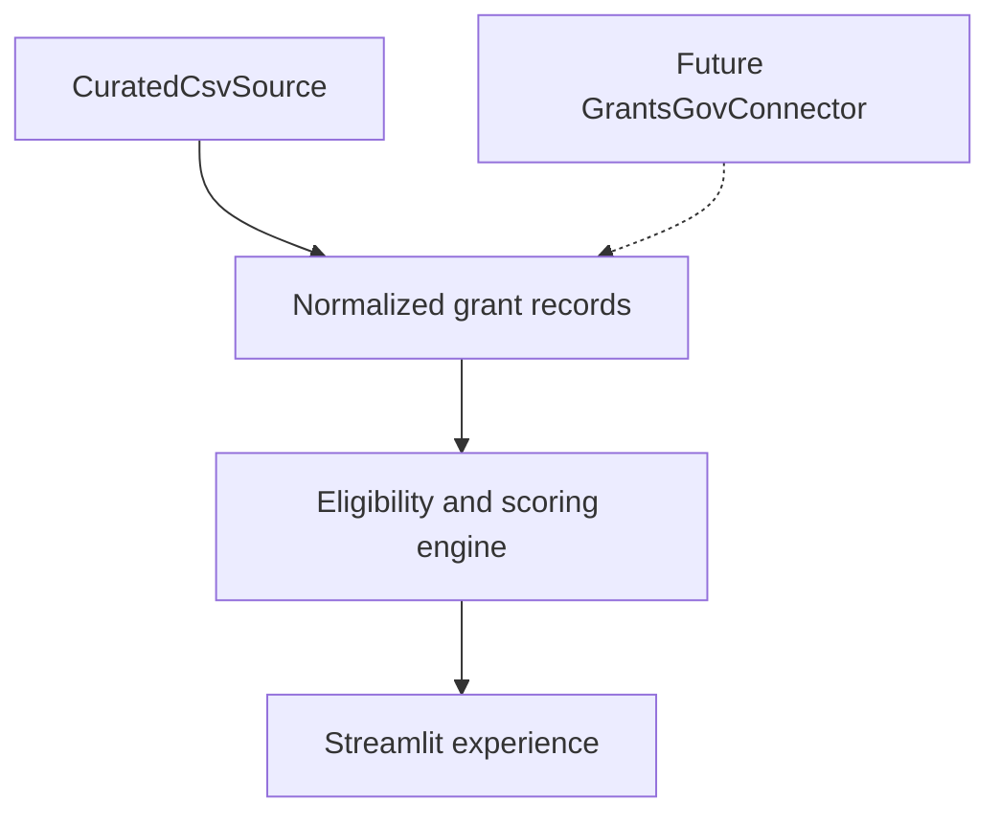

# Grant Funding Intelligence

An explainable grant-matching and funding-roadmap MVP for small-business and nonprofit founders—designed especially for visual learners.

The project turns a broad funding search into one plain-language decision:

> **Pursue now, prepare for the next cycle, use a referral pathway, or stop.**

## What the MVP delivers

- guided founder and project intake;
- hard eligibility screening for entity type, geography, rural rules, operating history, and required qualifiers;
- NLP-assisted mission matching with TF-IDF and cosine similarity;
- transparent 100-point fit scoring;
- visual match cards and score-composition dashboards;
- open, referral, cycle-watch, and do-not-pursue decisions;
- a personalized five-phase funding roadmap; and
- official source links, snapshot dates, and human-review warnings.

## Product flow



## Why this is different

Many grant lists treat “sounds relevant” as “eligible.” This MVP keeps three concepts separate:

| Question | System response |
|---|---|
| May this applicant pursue the program? | Hard eligibility screen |
| Does the opportunity align strategically? | Explainable weighted fit score |
| Is the organization ready to apply? | Visible readiness gaps and roadmap tasks |

The score is **not** an award prediction. A human must verify the current notice and make the final eligibility decision.

## Run locally

```bash
python -m venv .venv
source .venv/bin/activate
pip install -r requirements.txt
streamlit run dashboard_app.py
```

Three guided profiles are included so reviewers can explore the product immediately: community nonprofit, rural small business, and technology startup.

## Test

```bash
python -m unittest discover -s tests -v
python -m py_compile dashboard_app.py grant_funding_insights/*.py
```

## Scoring model

| Component | Weight |
|---|---:|
| Mission/NLP similarity | 35 |
| Focus-area overlap | 25 |
| Funding-range fit | 15 |
| Geography | 10 |
| Organizational readiness | 15 |

See [the full scoring and decision rules](docs/SCORING.md).

## Curated data snapshot

The MVP includes a reviewed, dated sample of public grant programs and funding pathways. It mixes open, referral, and closed-cycle examples so the interface can demonstrate realistic decisions.

The dataset is **not a live funding feed**. Program rules, deadlines, and funding levels change. Every record includes an official source URL and `last_verified` date, and the interface instructs the user to confirm the current notice before acting.

## Architecture and future live data

The curated CSV and future API connector share a source contract:



Live ingestion stays disabled until the connector includes pagination, freshness checks, deduplication, source provenance, error handling, and normalization tests.

## Responsible-use boundaries

- No funding or eligibility guarantee.
- No protected demographic characteristic receives score points.
- No profile data is persisted by the MVP.
- Closed cycles are labeled as cycle-watch items, not open funding.
- All scoring components and known gaps are visible.
- Human review is required before submission.

## Project structure

```text
dashboard_app.py                    Streamlit user experience
grant_funding_insights/matcher.py   Eligibility, NLP scoring, and roadmap logic
grant_funding_insights/sources.py   Curated and future live-source contracts
data/grants.csv                     Dated public-program demonstration snapshot
tests/test_matcher.py               Core decision-rule tests
docs/SCORING.md                     Method and responsible-use rules
docs/PORTFOLIO_CASE_STUDY.md        Portfolio narrative and architecture
```

## Portfolio case study

Read the [portfolio case study](docs/PORTFOLIO_CASE_STUDY.md) for the problem statement, users, architecture, design decisions, evidence, and next release.

---

Rolanda Anwar  
Founder | Principal Enterprise Architect  
Às̩e̩ Advisory and Tech

