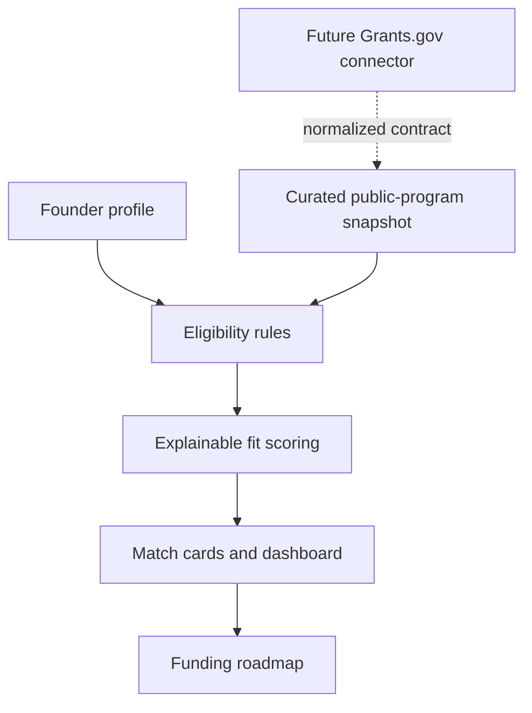

# Portfolio case study: Grant Funding Intelligence

## The problem

Small-business and nonprofit founders often find grant discovery overwhelming. Search results mix open and closed programs, direct awards and referral programs, strategic fit and legal eligibility. A promising title can cost hours before a founder discovers one disqualifying rule.

## The users

- small-business founders;
- nonprofit and community-organization leaders;
- advisors supporting underserved and underrepresented founders; and
- visual learners who need a guided decision path rather than a dense opportunity list.

## The decision this MVP supports

> Should this founder pursue, prepare for, refer into, or stop work on this funding opportunity?

## The solution

The Streamlit MVP creates a complete decision-support loop:

1. capture a short founder and project profile;
2. screen hard eligibility requirements;
3. rank strategic fit with explainable NLP and business rules;
4. visualize the strongest paths and score composition; and
5. convert one selected match into a five-phase funding roadmap.

## Architecture

## What makes the model explainable

The system does not hide one composite number behind an “AI” label. It shows five components: mission similarity, priority overlap, funding-range fit, geography, and readiness. It also names every failed eligibility rule and links to the official source.

## Design for visual learners

- numbered tabs create a clear sequence;
- labels accompany every status color;
- progress bars and horizontal comparisons show relative fit;
- match cards separate “why it matched” from “check before pursuing”; and
- the roadmap turns analysis into checkable next actions.

## Data and AI responsibility

- The dataset is a dated, curated demonstration snapshot—not a promise that funding is open.
- The tool does not predict awards.
- Protected demographic data is not part of the weighted score.
- The application does not persist founder profile data.
- Human verification remains a required gate.

## Portfolio evidence

This deliverable demonstrates enterprise architecture and data-contract design, NLP with TF-IDF and cosine similarity, deterministic eligibility and business-rule modeling, accessible data visualization, founder-centered product strategy, responsible-AI boundaries, and automated unit testing.

## Next release

1. Add a tested Simpler.Grants.gov/Grants.gov connector behind the source interface.
2. Add source freshness, deduplication, and change detection.
3. Expand the eligibility schema without collecting unnecessary personal data.
4. Add authenticated saved shortlists and deadline reminders.
5. Measure comprehension, time-to-decision, false-positive rate, and advisor overrides with real users.

